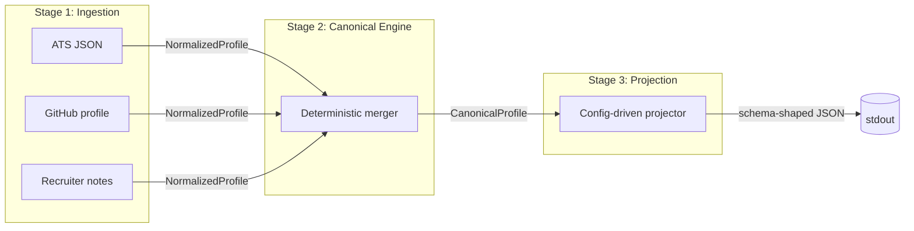

# Architecture

This document explains the current structure of `talent-forge`: the data flow, package responsibilities, shared contracts, runtime configuration, and extension points.

For the reasoning behind these choices, see [decisions.md](decisions.md). For test coverage and commands, see [testing.md](testing.md).

## High-Level Flow



The pipeline is intentionally split into three stages:

1. `extractor`: fetch and normalize one profile per source.
2. `merger`: resolve conflicts into one canonical profile with confidence and provenance.
3. `projector`: reshape the canonical profile into the requested output schema.

All shared structs live in `types`, so the stages do not import each other.

## Package Layout

| Package | Path | Responsibility |
| --- | --- | --- |
| `main` | [../main.go](../main.go) | CLI flags, embedded default config, logger setup, stage orchestration. |
| `types` | [../types/types.go](../types/types.go) | Shared contracts: source IDs, normalized profile, canonical profile, nested schema types. |
| `extractor` | [../extractor/extractor.go](../extractor/extractor.go) | Source ingestion, retry, normalization, concurrent fetch, graceful degradation. |
| `merger` | [../merger/merger.go](../merger/merger.go) | Deterministic conflict resolution, source weighting, confidence, provenance. |
| `projector` | [../projector/projector.go](../projector/projector.go) | Runtime field selection, remapping, normalization, missing-value policy, validation, JSON output. |

Dependency direction is one-way:

```text
main -> extractor -> types
     -> merger    -> types
     -> projector -> types
```

No stage package imports another stage package. `main` is the only place where the stages are composed.

## Canonical Schema

The canonical profile is defined in [../types/types.go](../types/types.go). It matches the project requirements more closely than the first version of the codebase: arrays are arrays, nested fields are structured, and every major field can carry confidence.

### Source Types

```go
const (
    SourceATS    Source = "ats"
    SourceGitHub Source = "github"
    SourceNotes  Source = "notes"
)
```

The current implementation uses:

| Source | Kind | Input shape |
| --- | --- | --- |
| ATS | structured | JSON record with candidate fields, experience, education, location. |
| GitHub | unstructured/API-like | Profile fields plus inferred languages, blog, location string. |
| Notes | unstructured | Free-text recruiter notes parsed with regular expressions and keyword matching. |

This satisfies the requirement to handle at least one structured source and one unstructured source.

### `NormalizedProfile`

Each extractor emits one `NormalizedProfile`:

```go
type NormalizedProfile struct {
    Source          Source
    CandidateID     string
    FullName        string
    Emails          []string
    Phones          []string
    Location        *Location
    Links           *Links
    Headline        string
    YearsExperience *float64
    Skills          []string
    Experience      []ExperienceEntry
    Education       []EducationEntry
    LastUpdated     time.Time
}
```

Extractor output is already cleaned before it reaches the merger:

- Names and strings are trimmed and whitespace-collapsed.
- Emails are lowercased and deduplicated.
- Phones are normalized into a simple E.164-like format.
- Countries are normalized to ISO-like two-letter codes where supported.
- Skills are deduplicated case-insensitively while preserving first-seen casing.

### `CanonicalProfile`

The merger emits one `CanonicalProfile`:

```go
type CanonicalProfile struct {
    CandidateID string

    FullName        FieldValue[string]
    Emails          FieldValue[[]string]
    Phones          FieldValue[[]string]
    Location        FieldValue[*Location]
    Links           FieldValue[*Links]
    Headline        FieldValue[string]
    YearsExperience FieldValue[float64]
    Skills          FieldValue[[]string]
    Experience      FieldValue[[]ExperienceEntry]
    Education       FieldValue[[]EducationEntry]

    Provenance        []ProvenanceEntry
    OverallConfidence float64
    FieldConfidence   map[string]float64
}
```

`FieldValue[T]` wraps each field value with:

- `value`: the resolved value.
- `source`: the winning or contributing source string.
- `confidence`: a number in `[0, 1]`.

`FieldConfidence` stores lookup keys such as `full_name.value`, `emails.value`, and `phones.value`. The projector uses those keys when `include_confidence` is enabled.

`Provenance` is a top-level audit trail. Each entry records the canonical field, source, and merge method, such as `weighted_choice`, `union`, or `merge`.

## Stage 1: Ingestion

The ingestion layer is implemented by the `Extractor` interface:

```go
type Extractor interface {
    Name() string
    FetchAndNormalize(ctx context.Context) (*types.NormalizedProfile, error)
}
```

### Built-In Extractors

`ATSExtractor` supports:

- Built-in demo data.
- File-backed JSON input via `-ats <path>`.
- Interactive stub values via `-interactive`.
- Candidate ID, name, email, phone, company/title, years of experience, location, skills, experience, education, and update timestamp.

`GitHubExtractor` supports:

- Built-in demo data.
- File-backed JSON input via `-github <path>`.
- Interactive stub values via `-interactive`.
- Name, public email, bio/headline, location string, blog/portfolio link, top languages, and update timestamp.

`NotesExtractor` supports:

- Built-in recruiter notes text.
- File-backed notes via `-notes <path>`.
- Direct raw text in tests.
- Regex extraction for emails, phones, URLs, and names after phrases like `spoke with`.
- Keyword extraction for skills such as Go, Python, Kubernetes, PostgreSQL, distributed systems, and cloud tooling.

### Retry And Degradation

Each extractor uses `withRetry`:

- 3 attempts by default.
- Exponential backoff.
- Full jitter.
- Context cancellation before and between attempts.
- Final error wraps the upstream error.

`FetchAll` runs extractors concurrently with `sync.WaitGroup`. If a source fails after retries, the pipeline logs a warning and leaves `nil` in that source's result slot. The merger skips nil entries, so one broken source does not crash the whole run.

## Stage 2: Canonical Engine

The merger filters nil profiles, then resolves every canonical field.

### Scoring Model

Scalar fields use:

$$
confidence = source\_weight(field, source) \times quality(value)
$$

Examples of source weights:

| Field | ATS | GitHub | Notes |
| --- | ---: | ---: | ---: |
| `candidate_id` | 0.9 | 0.1 | 0.1 |
| `full_name` | 0.6 | 0.5 | 0.4 |
| `emails` | 0.6 | 0.7 | 0.5 |
| `phones` | 0.8 | 0.1 | 0.6 |
| `skills` | 0.4 | 0.7 | 0.4 |
| `links` | 0.3 | 0.9 | 0.6 |
| `experience` | 0.9 | 0.2 | 0.4 |

Quality validators are intentionally simple:

- Empty strings score `0`.
- Valid email format scores `1`; malformed email scores `0`.
- Structured values score positively when they contain useful data.

When candidates tie on confidence, scalar selection uses a deterministic ladder:

1. Higher confidence wins.
2. Newer `LastUpdated` wins ties.
3. Alphabetical source name wins final ties.

This makes the merger stable even though extraction runs concurrently.

### Field Strategies

| Field | Strategy |
| --- | --- |
| `candidate_id`, `full_name`, `headline`, `years_experience` | Weighted scalar choice. |
| `emails`, `phones`, `skills` | Union and dedupe valid values. |
| `location` | Weighted structured choice. |
| `links` | Per-key merge: LinkedIn, GitHub, portfolio, and other links are combined. |
| `experience`, `education` | Union and dedupe by stable business keys. |
| `overall_confidence` | Average of recorded field confidences, rounded to two decimals. |

The current `types.Skill` struct exists for the richer target schema, but the live merger currently outputs `Skills` as `FieldValue[[]string]`. Skill names can still be projected and normalized with `normalize: "canonical"`.

## Stage 3: Dynamic Projection

The projector accepts a runtime config like:

```json
{
  "fields": [
    { "path": "full_name", "from": "full_name.value", "type": "string", "required": true },
    { "path": "primary_email", "from": "emails.value[0]", "type": "string" },
    { "path": "skills", "from": "skills.value", "type": "string[]", "normalize": "canonical" }
  ],
  "include_confidence": true,
  "on_missing": "null"
}
```

### Config Fields

| Key | Meaning |
| --- | --- |
| `fields` | Ordered list of output fields. |
| `fields[].path` | Output key to write. Required. |
| `fields[].from` | Canonical source path. Defaults to `path` when omitted. |
| `fields[].type` | Optional runtime validation: `string`, `number`, `boolean`, `string[]`, `object`, `object[]`. |
| `fields[].required` | Missing or empty value becomes a validation error. |
| `fields[].normalize` | Per-field projection normalization. Current values: `E164`, `canonical`. |
| `include_confidence` | If true, output each value as `{ "value": ..., "confidence": ... }`. |
| `on_missing` | One of `null`, `omit`, or `error`. Defaults to `null`. |

### Path Resolution

The projector resolves paths against the JSON form of `CanonicalProfile`.

Supported path examples:

- `candidate_id`
- `full_name.value`
- `emails.value[0]`
- `phones.value`
- `location.value`
- `links.value.github`

For repeated scalar fields, use the wrapped `.value` path directly, such as `skills.value`, or an indexed lookup like `emails.value[0]`. The current canonical `skills.value` is a plain string array, not an object array, so configs should not use `skills[].name`.

### Validation And Ordering

`ParseConfig` uses `json.Decoder.DisallowUnknownFields()`, so misspelled top-level or field keys fail fast.

`Project` validates required fields, missing-field policy, declared types, and normalization errors. It returns a `ValidationError` containing all projection failures rather than stopping at the first one.

Output order follows the order of `fields` in the config. `marshalOrdered` writes stable JSON so integration tests can assert deterministic output.

## CLI And Samples

`main.go` supports:

```bash
go run .
go run . -ats samples/ats.json -github samples/github.json -notes samples/notes.txt
go run . -config samples/configs/custom.json
go run . -interactive
```

Flags:

| Flag | Purpose |
| --- | --- |
| `-ats` | Path to ATS JSON input. Defaults to built-in sample. |
| `-github` | Path to GitHub JSON input. Defaults to built-in sample. |
| `-notes` | Path to recruiter notes text. Defaults to built-in sample. |
| `-config` | Path to projector config JSON. Defaults to embedded `samples/configs/default.json`. |
| `-interactive` | Prompts for ATS and GitHub values from stdin. |

The default config is embedded with `go:embed`, so `go run .` works without arguments. A custom config can be passed at runtime for demoing remapped or reduced output.

## Error Model

| Layer | Failure | Behavior |
| --- | --- | --- |
| Extractor file read/parse | Bad input file | Retries, then source degrades to nil. |
| Extractor simulated failure | `FailureRate` hit | Retries, then source degrades to nil. |
| All sources fail | No live profiles | Merger returns empty canonical fields with zero confidence. |
| Config parse | Invalid JSON, unknown fields, invalid `on_missing` | Fatal in `main`, logged and exit 1. |
| Projection validation | Required missing, type mismatch, bad normalization | Fatal in `main`, logged and exit 1. |

## Extension Points

Adding a source:

1. Add a `Source` constant in [../types/types.go](../types/types.go).
2. Implement `Extractor` in [../extractor](../extractor).
3. Add source weights in [../merger/merger.go](../merger/merger.go).
4. Add the extractor to the list in [../main.go](../main.go).
5. Add tests for normalization and degradation.

Adding a canonical field:

1. Add it to `NormalizedProfile` and `CanonicalProfile`.
2. Populate it in relevant extractors.
3. Resolve it in `Merge`.
4. Add confidence keys for projector lookup.
5. Add projection config and tests.
